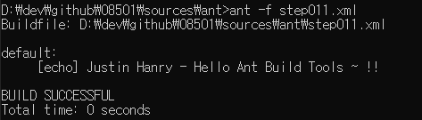
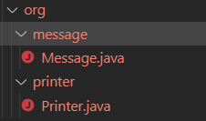

# ant

먼저 살펴 볼 것은 자동화 도구의 아버지 격인 ant에 대해서 다루어 보겠습니다.

ant는 자바 언어로 구성 되어 있으며 따라서 자바 환경에서 동작 하기 위해

자바의 설치 또는 환경 변수로 등록 할 필요가 있습니다.

기본적으로 ant는 xml을 지향하고 있기 때문에

`build.xml` 파일을 사용하여 프로젝트를 ant로 빌드 할 수 있도록 지원합니다.

차근 차근 따라해 보면서 엔트의 빌드 시스템에 관하여 이해 할 수 있도록 하세요.

## 기본 구성

ant의 기본 구성에 대해 설명 하겠습니다.

ant는 기본적으로 xml파일로 구성 되며 하나의 프로젝트와 하나 이상의 target으로 이루어져 있습니다.

먼저 xml파일을 생성 하여 프로젝트 태그를 작성해 보도록 하겠습니다.

[소스 보기](./sources/ant/step001.xml)

다음으로 하나의 프로젝트의 하나 이상의 타겟을 등록 할 수 있습니다.

간단한 테스트를 위해 타겟을 하나 등록 해 보겠습니다.

[소스 보기](./sources/ant/step002.xml)

타겟은 여러 개가 될 수 있습니다.

따라서 name 속성을 사용하여 구분 하도록 합니다.

우리가 만든 target에 `default` 네임을 주어 보도록 하겠습니다.

[소스 보기](./sources/ant/step003.xml)

이제 project의 기본 실행을 `default` name을 가진 타겟에 등록 하기 위해 `default` 속성을 사용하여

해당 프로젝트의 기본 타겟을 등록해 보도록 하겠습니다.

[소스 보기](./sources/ant/step004.xml)

이제 간단한 task를 등록 해 보도록 하겠습니다.

task(작업)는 빌드 시에 할 작업이며 이 작업은 후에 차근 차근 다룰 것이므로 어려워 하지 마세요.

task(작업)중 가장 간단한 `echo` task(작업)를 등록 해 보도록 하겠습니다.

echo task를 작성하는 방법은 echo 태그를 생성하여 task를 실행할 target에 등록 하면 됩니다.

[소스 보기](./sources/ant/step005.xml)

그렇다면 이제 메시지를 하나 찍어 보도록 하겠습니다.

메시지는 echo의 message 속성을 사용하여 출력 할 수 있습니다.

[소스 보기](./sources/ant/step006.xml)

이제 우리의 ant를 실행해 보도록 하겠습니다.

실행 방법은 해당 xml 파일 경로에서 `ant -f 파일명` 명령어를 사용하여 빌드 할 수 있습니다.

```tip

message 속성 값을 사용 하지 않고 태그의 값으로 등록 하여 출력 할 수 있습니다.

```

[소스 보기](./sources/ant/step007.xml)

<< 이미지 1-1. ant 첫 빌드 실행 >>


- - -

`xml` 파일은 기본적으로 build.xml 파일명으로 ant의 자동 검색 대상으로 실행 할 수 있으며

`-f` 옵션을 사용하여 빌드 파일을 적용 할 수 있습니다.

- - -

다시 돌아 가서 우리가 작성한 빌드 파일을 살펴 보도록 하겠습니다.

기본적으로 하나의 `project` 태그와 하나 이상의 `target` 태그와 각 `target`에 하나 이상의 `task`가 작성 된 것을 확인 할 수 있습니다.

## Properties

업무의 자동화를 위해서는 위해서는 설정 값에 따라 실행 되어야 할 필요가 있습니다.

이 떄를 위해서 ant에서는 다양한 properties를 제공합니다.

그 중 먼저 가장 간단한 것 부터 시작해 보도록 하겠습니다.

### 내부의 설정 값

내부의 설정 값을 등록 하기 위해서는 `property`태그를 사용하여 등록 할 수 있습니다.

우리가 작성한 `step007.xml` 에 `property`태그를 추가해 보도록 하겠습니다.

[소스 보기](./sources/ant/step008.xml)

`property` 태그는 하나 이상이 생길 수 있기 때문에 `name` 속성을 사용하여 구분합니다.

따라서 `name` 속성에 `userName` 을 추가 하여 다른 설정 값과 구분 짓도록 하겠습니다.

[소스 보기](./sources/ant/step009.xml)

이제 설정 태그에 값을 등록 해 보도록 하겠습니다.

값은 기본적으로 `value` 속성을 사용하여 등록 할 수 있습니다.

[소스 보기](./sources/ant/step010.xml)

이제 설정한 속성 값을 사용해 보도록 하겠습니다.

사용 하기 위해서는 자바 메타 기호인 `${}` 을 사용해 보도록 하겠습니다.

[소스 보기](./sources/ant/step011.xml)

이제 실행해 보도록 하겠습니다.

<< 이미지 1-2. 설정 값을 추가한 ant 빌드 >>



### 외부의 설정 값

외부의 값을 설정 하기 위해서는 `file` 속성값을 사용하거나 `url` 속성 값을 사용하여 외부의 소스를 읽어 들일 수 있습니다.


[소스 보기](./sources/ant/step012.xml)

## 의존성

하나 이상의 `target` 들은 각각 기능들을 수행 하지만 순차적 또는 계층적으로 구분이 필요 할 경우

`target`을 분리 하여 의존성을 추가 하여 작업 할 수 있습니다.

그전에 먼저 문자열을 출력 하는 기능을 추가 해보도록 하겠습니다.

문자열을 파일로 출력 하는 방법은 `echo` task에 출력할 파일명을 `file` 속성값으로 추가 하여 처리 할 수 있습니다.

[소스 보기](./sources/ant/step013.xml)

이제 만들어진 이 파일을 복사 하여 `dist/copy/copy_history.log`로 복사 하기 위해서는

먼저 `echo` 태그를 사용하여 파일을 만든 다음 `copy` task을 실행 하여 생성 된 파일을 복사 하여야 할 것입니다.

따라서 작업의 계층(순서)가 만들어 지고 이 계층(순서)를 `depends` 속성을 사용하여 각 target끼리 묶어 보도록 하겠습니다.

먼저 새로운 파일을 생성하여 `project` 태그를 만듭니다.

[소스 보기](./sources/ant/step014.xml)

이제 타겟을 만들어 보도록 하겠습니다.

타겟은 파일을 만드는 `build` 타겟와 파일을 복사 하는 `copy` 타겟을 만들어 보도록 하겠습니다.

각 타겟은 고유한 아이디를 지니며 이 아이디는 `name` 속성 값을 사용하여 지정 할 수 있습니다.

[소스 보기](./sources/ant/step015.xml)

기본 타겟으로 `copy` 로 등록 하여 기본 빌드를 실행 하겠습니다.

[소스 보기](./sources/ant/step016.xml)

이제 `echo` task와 `file`속성 값을 사용하여 해당 경로 `/dist/history.log` 파일을 생성 하도록 해 보겠습니다.

출력 값으로는 `Hello Ant Depends` 라고 하겠습니다.
(바로 출력 하기 위해서는 타겟을 직접 지정해 주어야 합니다 [`ant -f step017.xml build`])

[소스 보기](./sources/ant/step017.xml)

이제 `copy` 타겟과 `build` 타겟을 의존하여 보도록 하겠습니다.

`target`태그의 `depend` 속성 값을 사용하여 의존성을 등록 할 수 있습니다.

[소스 보기](./sources/ant/step018.xml)

파일이 만들어 지는 것을 확인 할 수 있을 것입니다.

<< 이미지 1-3. 의존성 등록 >>


의존성은 하나 이상이 될 수 있습니다.

구분자 `,`을 사용하여 여러분만의 다양한 의존성을 만들어 보세요

[소스 보기](./sources/ant/step019.xml)

이제 본문으로 돌아 와서 `copy` target에 파일을 복사 하는 작업(task)를 등록해 보도록 하겠습니다.

먼저 copy 태그를 사용하여 작업을 등록 해 봅니다.

[소스 보기](./sources/ant/step020.xml)

다음으로는 대상이 될 파일 경로 (file) 과 복사 할 경로(tofile, todir)를 사용하여 파일을 복사 합니다.

[소스 보기](./sources/ant/step021.xml)

이제 이 빌드 파일을 실행 하여 파일이 복사 되어 생성 되는지 확인 하세요

<< 이미지 1-4. 실행 결과 >>


- - -

***이행적 의존***

이행적 의존은 A -> B를 의존 하는 상태에서

B -> C(1.2) 를 만족할 때 A -> C를 이행적 의존 관계라고 표현합니다.

- - -

## compile

이번에는 `.java` 파일을 컴파일 한 다음 생성 된 `.class` 원하는 폴더에 복사해 보도록 하겠습니다.

먼저 `build.xml` 파일을 생성 하여 보겠습니다.

[소스 보기](./sources/ant/step022.xml)

이제 기본적으로 빌드 할 타겟을 생성한 다음 project의 기본 타겟으로 지정해 보겠습니다.
(기본 타겟 명을 build로 하였습니다.)

[소스 보기](./sources/ant/step023.xml)

먼저 빌드를 테스트 하기 위해서 `echo` 를 사용하여 메시지를 출력 해 봅니다.

[소스 보기](./sources/ant/step024.xml)

이제 자바 파일을 하나 만들어 보겠습니다.

[소스 보기](./sources/ant/step025.java)

다음으로 `javac` task를 사용해 보도록 하겠습니다.

`javac` task는 아래 기능을 사용 할 수 있습니다.

|속성|설명|
|:---|:---|
|srcdir|자바 파일이 위치하는 디렉토리|
|destdir|클래스 파일이 적제 되는 디렉토리|
|includes|입력 필터링 시 사용할 패턴 ',' 단위로 등록 할 수 있습니다|
|includesfile|입력 필터링 시 사용할 파일명을 명시하며 ',' 단위로 등록 할 수 있습니다|
|excludes|출력(배척) 필터링 시 사용할 패턴 ',' 단위로 등록 할 수 있습니다|
|excludesfile|출력(배척) 필터링 시 사용할 파일명을 명시하며 ',' 단위로 등록 할 수 있습니다|

그 외에도 ant는 많은 속성을 가지고 있으니 직접 찾아 보기 바랍니다.

그렇가면 이 것을 가지고 자바 파일을 컴파일 하여 보겠습니다.

먼저 javac task를 등록 합니다.

[소스 보기](./sources/ant/step026.xml)

java파일이 위치한 곳을 `srcdir`속성 값을 사용하여 지정 합니다.

[소스 보기](./sources/ant/step027.xml)

다음으로 `includes`속성을 사용하여 해당 모든 `.java`파일을 등록 합니다.

[소스 보기](./sources/ant/step028.xml)

이제 출력 할 폴더를 지정 해 보겠습니다.

[소스 보기](./sources/ant/step029.xml)

소스를 보게 되면 `build`를 폴더로 지정 하였는데 `build`폴더가 없기 때문에 에러가 발생 할 것입니다.

<< 이미지 1-5. build 폴더가 없어 에러 발생 >>


따라서 `build` 폴더를 만들어 주는 타겟을 하나 만들어 depends를 걸어 둔 다음 로그를 하나 찍도록 하겠습니다.
(depends는 이전에 다루었기 때문에 빠르게 넘어 가겠습니다.)

[소스 보기](./sources/ant/step030.xml)

이제 폴더를 만들어 보도록 하겠습니다.

폴더는 `mkdir` task를 사용하여 실행 시킬 수 있습니다.

mkdir은 `dir` 속성만을 가진 단순한 task입니다.

이제 build 디렉토리를 만들어 보도록 하겠습니다.

[소스 보기](./sources/ant/step031.xml)

이제 이전 스크립트를 실행 하여 보면 컴파일 되는 것을 확인 할 수 있을 것입니다.

컴파일 한 결과를 `copy`하여 보도록 하겠습니다.

- - -

copy는 `copy`(파일 기준) task와 `copydir`(폴더 기준) task가 있으니 원하는 것을 사용 하면 됩니다.

- - -

먼저 새로운 타겟을 만들어 보도록 하겠습니다.

`install`이라는 타겟을 만든 다음 해당 타겟을 기본 타겟으로 등록 합니다.

[소스 보기](./sources/ant/step032.xml)

다음으로 depends를 build 타겟으로 걸어 두어 의존성을 가지도록 하겠습니다.

[소스 보기](./sources/ant/step033.xml)

이제 `copy` task를 사용하여 build/classes로 파일을 복사 한 다음 해당 파일을 삭제 해 보도록 하겠습니다.

먼저 `copy` task를 추가 합니다.

[소스 보기](./sources/ant/step034.xml)

이번에는 fileset을 사용해 보도록 하겠습니다.

fileset은 include와 exclude를 사용하여 원하는 파일의 리스트를 만들 수 있습니다.

그렇다면 일단 생성해 보도록 하겠습니다.

[소스 보기](./sources/ant/step035.xml)

fileset은 파일을 필터링 하고 원하는 리스트를 추출 하려고 사용 합니다.

우리는 `step025.java` 파일과 `build`에 컴파일 된 `HelloAntBuild.class` 파일을 `build/source` 폴더에 복사 해 보도록 하겠습니다.

먼저 filterset에 `dir` 속성 값을 사용하여 필터링이 필요한 폴더를 정의합니다.

[소스 보기](./sources/ant/step036.xml)

이제 `include` 속성을 사용하여 원하는 파일을 선택 합니다.
(여러 폴더를 지정 할 경우 `build/*.class`와 같이 파일셋에 등록 할 수 있지만 다른 디렉토리에 있는 파일들을 지정 할 것이기 때문에 파일 셋을 두개로 나누었습니다.)

[소스 보기](./sources/ant/step037.xml)

이제 마지막으로 이전의 `.class`파일을 삭제 하여 보도록 하겠습니다

삭제는 `delete` task를 사용하여 정의 할 수 있으며 `delete`의 경우도 fileset을 사용해 보도록 하겠습니다.

[소스 보기](./sources/ant/step038.xml)

<< 이미지 1-6. 실행 결과 >>


## jar패키징 해 보기

이번에는 java를 실행 가능한 jar로 패키징 해 보도록 하겠습니다.

먼저 클래스의 묶음을 만들어 의존성을 엮어 보도록 하겠습니다.

폴더로 만들어 실행 가능한 `.java` 파일을 만들어 보겠습니다.
(step039 폴더 참조)

먼저 파일을 만든 다음 `package`를 등록 합니다.

[소스 보기](./sources/ant/step040.xml)

다음으로 `jar` 타겟을 만들어 기본 빌드로 지정 합니다.

[소스 보기](./sources/ant/step041.xml)

이제부터는 설정을 가지고 작업 하도록 하겠습니다.

`basedir`설정 값을 하나 `package`에 등록 해 보도록 하겠습니다.

[소스 보기](./sources/ant/step042.xml)

이제 $와 중괄호(`brace, {}`)를 사용하여 설정 값을 추출해 올 수 있습니다.

먼저 compile 타겟을 생성하여 class파일을 추출해 보도록 하겠습니다.
(compile은 이전에 설명 하였기 때문에 빠르게 넘어 가도록 하겠습니다.)

[소스 보기](./sources/ant/step043.xml)

이제 `jar` task를 사용하여 class파일을 jar로 패키징 해 보도록 하겠습니다.

먼저 `jar` task를 생성해 보도록 하겠습니다.

[소스 보기](./sources/ant/step044.xml)

다음으로 jar를 패키징할 기본 경로와 jar파일을 생성할 경로를 지정해 줍니다.

기본 경로는 `basedir`로 지정 할 수 있으며 생성할 대상 경로는 `destfile` 로 지정 할 수 있습니다.

[소스 보기](./sources/ant/step045.xml)

이제 fileset 태그를 사용하거나 includes 속성을 사용하여 모든 클래스 파일을 선택하여 패키징 해 보도록 하겠습니다.
(jar task의 basedir 을 사용하면 해당 폴더 아래의 모든 class파일을 패키징 하기 때문에 fileset을 사용 할 필요가 없습니다.)

[소스 보기](./sources/ant/step046.xml)

이제 실행 해 보도록 하겠습니다.

만일 실행 하게 되면 아래와 같읕 에러가 발생하는 것을 확인 할 수 있을 것입니다.

<< 이미지 1-7. jar 파일 에러 발생 >>


기본적으로 jar파일은 class의 묶음입니다.

따라서 class의 기본 등록 설정(내용)이 필요 하며 이 파일이 `Manifest` 파일이라고 합니다.

그렇다면 이제 이 `Manifest`를 생성해 보도록 하겠습니다.

Manifest 는 jar task내에 등록 하며 아래와 같이 등록 할 수 있습니다.

[소스 보기](./sources/ant/step047.xml)

이제 `Main-Class`를 등록 하여 실행 가능한 jar파일을 만들어 보겠습니다.

Manifest의 속성값을 등록 하는 방법은 `attribute` 태그를 사용하여 `name` 과 `value` 으로 속성값을 등록 가능합니다.

[소스 보기](./sources/ant/step048.xml)

<< 이미지 1-8. jar 파일 실행 결과 >>


마지막으로 기존의 compile과 clean을 엮어 새로운 타겟을 만들겠습니다.

[소스 보기](./sources/ant/step049.xml)

이제 타겟에 있는 jar파일을 우리가 원하는 곳으로 이동 하는 것을 끝으로 jar 챕터는 끝내도록 하겠습니다.
(copy는 위에서 배웠으므로 move도 동일하므로 빠르게 넘어 가도록 하겠습니다.)

[소스 보기](./sources/ant/step050.xml)

# war패키징 해 보기

이번에는 웹 애플리케이션을 만들어 보도록 하겠습니다.

웹 어플리케이션을 만들기 위해서는

웹 구조를 먼저 이해해야 합니다.

웹 구조는 아래와 같은 전형적인 CoC 구조를 가지고 있습니다.

<< 이미지 1-9. 전형적인 java진형 web 구조 >>


먼저 복습하는 개념으로 자바 소스를 하나 만들어 보도록 하겠습니다.

`build.xml`파일을 만든 다음 `project` 태그를 사용하여

루트를 빌드 합니다.

[소스 보기](./sources/ant/step051.xml)

다음으로 우리가 작성할 기본 `target`를 정의합니다.

`target`명(name)은 jar로 하겠습니다.

[소스 보기](./sources/ant/step052.xml)

target이 정의 되었으면 target의 기본으로 빌드하기 위하여

`project`에 default값으로 해당 target명을 등록합니다.

[소스 보기](./sources/ant/step053.xml)

이제 java파일들을 만들어 보겠습니다.

자바 파일로는 Message와 Printer로 하겠습니다.

Message는 정적 문자열을 가지고 있으며
Printer는 Message와 외부 인자를 사용하여 기본출력을 하는 형식입니다.

아래와 같이 폴더를 정의한 다음 해당 폴더에 두 파일을 만듭니다.

<< 이미지 1-10. java 패키지 구조 >>



[Message.java](./sources/ant/step054/org/message/Message.java)

[Printer.java](./sources/ant/step054/org/printer/Printer.java)

다시 돌아 가서 해당 클래스를 jar파일로 묶어 보도록 하겠습니다.

jar로 묶기 위해서는 해당 자바 파일이 class로 컴파일 될 필요가 있습니다.
(타겟 하나에 너무 많은 일을 하는 일은 복합적인 에러가 발생할 우려가 있으며 하나의 작업 단위로 타겟을 설정 하는 것이 재사용성이 높은 일반적인 패턴입니다. )

따라서 `compile` target을 하나 정의 한 다음 해당 target을 의존해 보도록 하겠습니다.

[소스 보기](./sources/ant/step055.xml)

이제 해당 파일을 컴파일 해 보겠습니다.

컴파일은 javac를 사용하여 컴파일 합니다.

따라서 `javac` task를 등록합니다.

[소스 보기](./sources/ant/step056.xml)

다음으로 `javac` task는 `srcdir:java파일의 기준 경로`와 `destdir:class파일의 기준 경로`를 지정하여 컴파일 가능합니다.

따라서 srcdir을 step054로 destdir을 step054_build로 지정하여 생성합니다.

[소스 보기](./sources/ant/step057.xml)

콘솔에서 xml파일을 실행하면 해당 폴더가 없다는 에러가 발생합니다.

따라서 `init` target을 하나 만든 다음 `mkdir` task를 사용하여 폴더를 생성합니다.
(기존의 파일을 지우기 위하여 clean 타겟을 등록하여 의존하는 것도 좋은 방법입니다.)

[소스 보기](./sources/ant/step058.xml)

이제 cmd로 해당 빌드를 실행하면 아래와 같은 구조를 가진 폴딩을 볼 수 있습니다.

<< 이미지 1-11. class 패키지 구조 >>


컴파일 된 class파일들을 jar파일로 묶어 보도록 하겠습니다.

`jar target`에 `jar task`를 생성한 해 봅니다.

[소스 보기](./sources/ant/step059.xml)

다음으로 jar task는 `basedir:class들의 기준 경로`와 `destfile=목적 jar파일` 을 인자로 받으므로 해당 속성을 등록해 주도록 하겠습니다.

[소스 보기](./sources/ant/step060.xml)

cmd 창에서 해당 ant를 실행하면 아래와 같이 target 폴더에 jar파일이 룰린 것을 확인 할 수 있습니다.
(jar생성 후 우리가 만든 clean task를 실행하여 초기화 하는 dist라는 타겟을 생성해 실행하면 더 좋은 방법입니다. )

[소스 보기](./sources/ant/step061.xml)

<< 이미지 1-12. jar 파일 생성 >>


그럼 이제 이 jar파일을 사용하는 새로운 자바 파일을 만들어 보겠습니다.

파일명은 MessagePrinter.java 입니다.

<< 이미지 1-13. java 패키지 구조 >>


[MessagePrinter.java](./sources/ant/step062/com/message/MessagePrinter.java)

추가로 lib폴더를 만든 다음 이전 작성한 파일을 넣어 주도록 하겠습니다.

<< 이미지 1-14. java(lib) 패키지 구조 >>


이전과 동일하게 빌드 파일을 만든 다음 빌드 해 보도록 하겠습니다.

이전까지 해 온것은 간략하게 스킵하도록 하겠습니다.

이전 xml파일을 그대로 불러와서 붙여 넣어 보면 바뀌어야 할 부분들이 보일 것입니다.

<< 이미지 1-15. class 패키지 구조 >>


해당 경로를 설정 파일로 분리 하여 설정 경로를 불러 오도록 하겠습니다.

[소스 보기](./sources/ant/step063.xml)

이제 실행해 보도록 하겠습니다.

실행하게 되면 아래와 같은 에러가 발생할 것입니다.

<< 이미지 1-16. 에러 발생 >>


실행 하기 위해서는 참고 되는 클래스가 기준 경로에 존재 하여야 합니다.

따라서 이 경로를 classpath에 등록 하여야 합니다.

이제 클래스 패스를 등록해 보도록 하겠습니다.

클래스 패스는 classspath 태그를 사용하여 등록 가능합니다.

[소스 보기](./sources/ant/step064.xml)

다음으로 웹 리소스에 관하여 다루어 보도록 하겠습니다.

웹은 크게 정적 웹 리소스와 설정 파일들 그리고 동적 웹 리소스와 설정 파일이 있습니다.

일반적인 자바 웹 애플리케이션은 아래와 같은 구조를 지니게 됩니다.

+-- 웹 애플리케이션
     |
     +-- 웹 리소스(html과 같은 정적 파일)
     |
     +-- 웹 설정 파일(웹 리소스에서 사용 할 xml파일 및 설정 파일)
     |
     +-- 자바 리소스(class와 lib와 같은 동적 리소스 파일들)
     |
     +-- 자바 설정 파일(자바 리소스에서 사용 할 xml파일 및 설정 파일)

아래와 같은 웹 서비스를 위한 리소스가 있다고 가정 해 봅니다.
(아파치 톰켓은 provider를 위한 공유 라이브러리를 위하여 등록 하였습니다)

<< 이미지 1-17. 웹 서비스를 위한 기본 구조 >>


이제 하나 하나 작성해 보도록 하겠습니다.

먼저 파일을 만든 다음 project를 생성합니다.

[소스 보기](./sources/ant/step066.xml)

다음으로 작성할 task를 등록 한 다음 기본 테스크로 등록 합니다.
(테스크는 war로 만들어 보도록 하겠습니다.)

[소스 보기](./sources/ant/step067.xml)

war로 패키징 하기 위해서 아래 순서 대로 해 보겠습니다.

1. 웹 리소스를 복사 하여 루트에 등록 합니다.
2. 웹 설정 파일을 복사 하여 웹 루트에 등록 합니다.
3. 자바 파일을 컴파일 하여 WEB-INF의 classes에 이동 합니다.
4. 자바 설정 파일을 복사 하여 WEB-INF의 classes에 이동 합니다.

먼저 1번과 2번을 해 보도록 하겠습니다.

웹 리소스와 설정 파일을 복사 하기 위해서 스크립트에 설정 파일 내부 또는 외부에 경로를 등록 합니다.

경로는 프로젝트에서 basedir로 작성하여 등록 할 수도 있으며 설정 파일로 분리 할 수도 있습니다.

[소스 보기](./sources/ant/step068.xml)

먼저 웹 리소스를 복사해 봅니다.

복사는 copy task를 사용합니다.

[소스 보기](./sources/ant/step069.xml)

다음으로는 자바 파일을 컴파일 하여 WEB-INF의 classes로 이동 합니다.

[소스 보기](./sources/ant/step070.xml)

마지막으로 자바 설정 파일을 복사 하여 자바 파일을 구동 할 수 있도록 합니다.

[소스 보기](./sources/ant/step071.xml)

완성 되었습니다.

이제 war로 패키징 해 보도록 하겠습니다.

war패키징은 jar와 동일하게 war task를 사용하여 간단하게 생성 가능합니다.

[소스 보기](./sources/ant/step072.xml)

<< 이미지 1-18. 완성된 패키지 >>


하지만 완성해 놓고 보니 뭔가 지저분 합니다.

그래서 각각의 기준에 맞도록 하나하나 정리해 보도록 하겠습니다.

먼저 자바를 컴파일 하는 부분을 compile target으로 분리 한 다음 의존성을 부여해 보겠습니다.

[소스 보기](./sources/ant/step073.xml)

다음으로 웹 리소스를 복사 하는 부분을 web target으로 분리 하여 보겠습니다.

[소스 보기](./sources/ant/step074.xml)

다음으로 자바 리소스를 복사 하는 구문을 copy target으로 분리 해 보겠습니다.

[소스 보기](./sources/ant/step075.xml)

다음으로 폴더를 생성하거나 초기화 기능을 가진 부분들을 분리 하여 보겠습니다.

[소스 보기](./sources/ant/step076.xml)

마지막으로 빌드 시 사용한 자원(build)을 초기화 하도록 하겠습니다.

[소스 보기](./sources/ant/step077.xml)

고생하셨습니다.

이렇게 war 패키징 까지 끝났습니다.

ant를 배우면서 기본적인 웹의 구조를 이해 하고 다음으로 maven을 정리 해 보도록 하겠습니다.

ant는 그 외에다 다양한 기능을 제공하고 있으니 더 자세한 사항은 

ant 공식 문서를 보면서 사용법을 숙지 하기 바랍니다.

[공식문서](https://ant.apache.org/manual/index.html)
