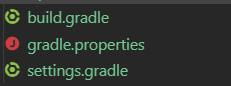
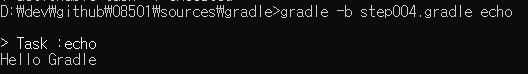
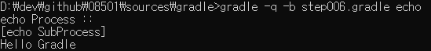

# gradle

그래들은 오픈 소스 빌드 자동 툴로써 적응성(여러 환경에서의 동일한 처리)를 기본으로 두고 개발된 툴입니다.

그래들의 빌드 스크립트(DSL)은 그루비 언어 또는 코틀린 언어로 작성 될 수 있습니다.  
(따라서 두 언어중 하나를 선택 하여 익히는걸 추천 합니다.)

먼저 그래들이 메이븐 보다 어떤 면에서 좋은지를 알아 보도록 하겠습니다.

1. 수정 변환을 사용자의 원하는 대로 가능합니다.
2. 정적 구조(XML)가 아닌 동적 구조(Script)로 작성 되어 단순해 졌습니다.
3. 정적 구조의 구현화 된 파싱 보다는 동적 구조의 일반적인 파싱이 속도 면에서 우월합니다. (대용량의 파일 입출력의 경우 속도가 떨어 질 수도 있습니다)

아래와 같은 장점을 지닌 그래들을 사용하는 방법을 알아 보고

빌드 장을 마치도록 하겠습니다.

다음에는 자동화 빌드 도구인 `jenkins`를 정리해 보도록 하겠습니다.

## 그래들 기본 구조

그래들은 기본적으로 빌드 시 `build.gradle` 파일을 사용하여 스크립트 파일을 빌드 합니다.

또한 `build.gradle` 파일을 빌드 할 때 `settings.gradle`의 유무를 확인하여

프로젝트의 설정에 `settings.gradle` 파일을 등록 합니다.

다음으로 설정 파일이 있을 경우 기본적으로 `gradle.user.home` 폴더를 기준으로 `gradle.properties`을 로드 하여 사용 합니다.

따라서 그래들은 기본적으로 아래와 같은 구조를 지니게 됩니다.

<< 이미지 1.1 gradle dafault file structure >>

### echo

이제 `build.gradle` 파일에 그루비를 사용하여 `Hello Gradle`을 출력 해 보도록 하겠습니다.

먼저 `build.gradle` 파일을 생성 해 보도록 하겠습니다.

[소스보기](./sources/gradle/step002.gradle)

다음으로 task를 등록 해 보도록 하겠습니다.

그래들은 task는 아래와 같은 구조를 지니고 있습니다.

<< 이미지 1.2 build file structure >>

빌드 스크립트는 하나 이상의 `project`로 이루어져 있으며  
(프로젝트는 멀티 프로젝트를 구성할 때 사용 할 것이므로 나중에 보도록 하겠습니다.)

각 `project`는 하나 이상의 `task`를 가지고 있으며

각 `task`는 하나 이상의 `action`으로 구성 됩니다.

- - -

projects...
   +-- tasks...
         +-- actions...

- - -

이제 task를 하나 생성해 보도록 하겠습니다.

[소스보기](./sources/gradle/step003.gradle)

`task` 하나가 생성 되었습니다.

이제 생성된 task에 action을 하나 추가 하여 동작 할 수 있도록 해 보겠습니다.

- - -

task는 기본적으로 큐 구조를 가지고 있으므로 만일 처리 될 action을 앞쪽에 담고 싶을 경우 `doFirst`를 사용 하며

뒤쪽에 담을 경우 `doLast` 함수를 사용하여 처리 문을 담을 수 있습니다.

- - -

[소스보기](./sources/gradle/step004.gradle)

이제 build.gradle을 실행 하여 echo task를 실행해 보도록 하겠습니다.

<< 이미지 1.3 first gradle build >>

잘 실행 되는 것을 확인 할 수 있을 것입니다.

- - -

만일 기본 프로젝트의 기본 task를 등록 할 경우 아래와 같이 작성 할 수 있습니다.

[소스보기](./sources/gradle/step005.gradle)

- - -

이제 action을 더 추가 하여 보도록 하겠습니다.  

[소스보기](./sources/gradle/step006.gradle)

실행 결과를 확인해 보도록 하겠습니다.

<< 이미지 1.4 doLast and doFirst >>

이번에는 `task`를 추가해 보도록 하겠습니다.

하나의 `project`에서 `task`는 하나 이상 등록 가능합니다.

테스크 작성시 아래와 같이 등록 할 수도 있습니다.

[소스보기](./sources/gradle/step007.gradle)

`task`는 각각의 관점에 따라 동작을 하도록 작성 되고 있습니다.

따라서 각 `task`를 묶어 작업 사이클을 구성하여 의존성을 맷어 줄 필요가 있습니다.

이제 의존성을 등록 해 보도록 하겠습니다.

의존성은 `dependsOn`을 사용하여 등록 할 수 있습니다.

[소스보기](./sources/gradle/step008.gradle)

빌드 스크립트는 하나 이상의 `project`로 이루어져 있으며  
(프로젝트는 멀티 프로젝트를 구성할 때 사용 할 것이므로 나중에 보도록 하겠습니다.)

각 `project`는 하나 이상의 `task`를 가지고 있으며

각 `task`는 하나 이상의 `action`으로 구성 됩니다.

- - -

projects...
   +-- tasks...
         +-- actions...
