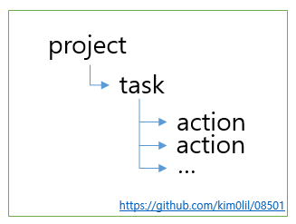
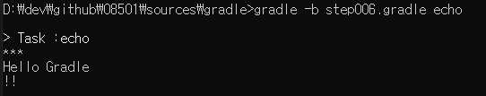

# gradle

그래들은 오픈 소스 빌드 자동 툴로써 적응성(여러 환경에서의 동일한 처리)를 기본으로 두고 개발된 툴입니다.

그래들의 빌드 스크립트(DSL)은 그루비 언어 또는 코틀린 언어로 작성 될 수 있습니다.  
(따라서 두 언어중 하나를 선택 하여 익히는걸 추천 합니다.)

먼저 그래들이 메이븐 보다 어떤 면에서 좋은지를 알아 보도록 하겠습니다.

1. 수정 변환이 사용자의 원하는 대로 수정 가능합니다.
2. 정적 구조가 아닌(Xml) 동적 구조(Script)로 작성 되어 단순해 졌습니다.
3. 정적 구조의 구현화된 파싱 보다는 동적 구조의 일관적인 파싱이 속도 면에서 우월합니다.

아래와 같은 장점을 지닌 그래들을 사용하는 방법을 알아 보고

빌드 장을 마치도록 하겠습니다.

다음에는 자동화 빌드 도구인 `jenkins`를 정리해 보도록 하겠습니다.

(중간 gradle문법도 설명 하니 빼먹은 그래들 문법의 경우 찾아 보는 것도 좋습니다.)

그래들은 기존 빌드툴과는 다르게 xml이 아닌 `.gradle`이라는 확장자를 사용하여 빌드 스크립트를 작성합니다.

`gradle` 빌드 시 기본으로 `build.gradle`을 사용 하므로 숙지 하시기 바랍니다.

- - -

만일 `build.gradle` 외의 파일을 사용할 경우

`-b` 옵션을 사용하여 빌드 파일을 선택 할 수 있습니다.

```s
gradle -b step001.gradle
```

- - -

## 시작은 echo

이번에도 간단하게 메시지를 출력하는 기능 부터 추가해 보면서 배워 가도록 하겠습니다.

먼저 파일을 하나 생성 하겠습니다.

[소스보기](./sources/gradle/step001.gradle)

### task

그래들은 ant와 비슷하게 스크립트를 사용하여 빌드 구조를 명시 합니다.

따라서 각 작업을 명시 하는 단위를 `task`라고 하며 `task` 단위로 `action`이 추가 되어 동작하게 되는 것입니다.

<< 이미지 1-1. workset on gradle >>


project는 추후에 확인 하고 먼저 task를 등록해 보도록 하겠습니다.

task는 task 문장을 사용하여 등록 할 수 있습니다.
(task 명은 `echo`로 하도록 하겠습니다)

[소스보기](./sources/gradle/step002.gradle)

task를 추가 하였으면 다음으로는 action을 등록 해 보겠습니다.

action은 shift(앞쪽에 기능 등록), push(뒤쪽에 기능 등록)로 등록 할 수 있습니다.

shift를 사용하는 방법으로는 `doFirst`로 사용하며 push를 사용하는 방법으로는 `doLast`를 사용합니다.

그렇다면 먼저 간략하게 action을 하나 추가해 보도록 하겠습니다.  
(stdout을 사용하여 출력 해 보도록 하겠습니다.)

[소스보기](./sources/gradle/step003.gradle)

이제 실행하여 결과 잘 출력이 되는 것을 확인 합니다.

<< 이미지 1-2. first gradle task >>



- - -

그래들의 기본 빌드 파일은 build.gradle 입니다.

하지만 특정 파일을 빌드 파일로 등록 하기 위해서는 아래와 같이 빌드 파일을 직접 등록 할 수 있습니다.

```s
gradle -b 빌드-파일명 [tasks]
```

- - -

### 의존성

이번에 할 것은 의존성 등록 입니다.

project의 여러 task들이 있을 경우 각 task를 묶어 새로운 task를 작성 할 수 있습니다.
(ant에서 했던 것 참조)

이때 사용하는게 `의존성(dependsOn)`입니다.

의존성이 필요한 task를 하나 더 생성해 보겠습니다.  
(task의 고유 아이디를 문자열로 등록 할 수 있습니다.)

[소스보기](./sources/gradle/step004.gradle)

이제 두 task의 의존성을 등록해 보도록 하겠습니다.

[소스보기](./sources/gradle/step005.gradle)

이제 실행 결과를 확인하여 두 task가 잘 의존하고 있는지 확인 합니다.

<< 이미지 1-3. print dependsOn >>


의존성을 하나 더 추가해 보도록 하겠습니다.

이번에는 task를 생성하는 방법과 의존성 설정을 유심히 살펴 보시기 바랍니다.

[소스보기](./sources/gradle/step006.gradle)

<< 이미지 1-4. multi task dependsOn >>



task의 ID를 등록 하는 방법은 아래 3가지 방법으로 작성할 수 있습니다.

|코드|설명|
|:---|:---|
|task echo|task를 DSL구문으로 할당 합니다.|
|task('echoProcess')|task에 ID로 문자 값을 할당 합니다.|
|tasks.create('echoSubProcess')|tasks(전체 task)에 create 메서드를 사용하여 할당 합니다.|

#### 변수 사용

이번에는 스크립트 내에서 변수를 할당 하여 사용 해 보도록 하겠습니다.  
(변수를 할당 할 때는 def(동적 타입) 또는 타입명을 명시 하여 선언 합니다.)

[소스보기](./sources/gradle/step007.gradle)

로컬 변수는 해당 스크립트 내에서만 사용 가능 합니다.

따라서 아래와 같이 작성할 경우 에러가 발생합니다.

[소스보기](./sources/gradle/step008.gradle)

이럴 때를 위하여 전역 적으로 사용할 수 있는 ext 를 사용하여 변수를 외부에서도 사용 하도록 할 수 있습니다.

[소스보기](./sources/gradle/step009.gradle)

또는 외부로 설정 파일을 분리하여 처리 할 수도 있습니다.

먼저 설정 파일을 만들어 보겠습니다.

[소스보기](./sources/gradle/step010.properties)

설정 파일을 사용 할 수 있도록 빌드 파일을 수정 하겠습니다.

[소스보기](./sources/gradle/step011.gradle)

코드를 보면 알 수 있듯이 echo 가 intialize 을 의존 하는 것을 알 수 있습니다.

그림으로 보면 아래와 같습니다.

<< 이미지 1-5. depends flow >>


흥미로운 점은 스크립트에서 자바 소스가 사용 될 수 있다는 것이다.

이점에 대해서 자세히 살펴 보도록 하자.

#### 그루비

그루비는 자바의 가상 머신 위에서 동작하는 스크립트 형의 동적 타입을 지원하는 언어 입니다.

이 언어는 동적 타입을 지원하므로 아래와 같은 식을 사용할 수 있습니다.

사용법을 간략하게 보여 드리겠습니다.

##### 동적 타입

자바는 정적 타입으로 타입을 명시 해야 하는 반면 그루비는 동적 타입을 지원합니다.

[소스보기](./sources/gradle/step012.gradle)


