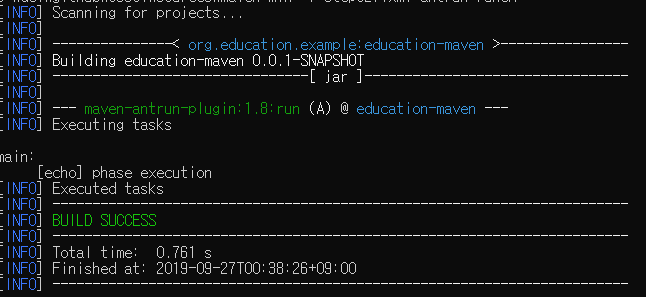
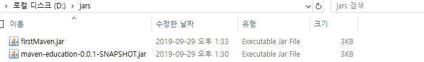

# maven

아파치의 메이븐은 자바용으로 설계 된 프로젝트 관리 툴(tools)입니다.

또한 메이븐은 ant를 대신할 용도록 개발 되었으며(apache) 자바를 개발하는 도중 필요한 의존성 관리와 빌드 기능을 가지고 있습니다.

이렇듯이 메이븐은 프로젝트의 전반적인 관리(통합 관리)를 위한 다양한 플러그인을 지원하고 있습니다.

이 장에서는 메이븐의 주요 플러그인과 메이븐을 다루는 방법을 다룰 예정입니다.

maven은 ant와 동일하게 `xml`파일을 지향하며 이 파일의 기본 이름은 pom.xml(project object model) 파일입니다.

그렇다면 차근 차근 따라 하면서 메이븐을 능숙하게 사용 할 수 있도록 해 보세요

## 메이븐의 기본 구조

먼저 알아야 될 것은 메이븐은 플러그인을 실행 시키는 프레임워크 기반의 툴이라는 것입니다.

(다양한 플러그인이 있으며 이 플러그인을 단지 실행하는 데 초점을 맞추며 따라서 플러그인이 하는 동작에는 관여 하지 않는 다는 것입니다.)

이점을 유의 하며 뒤쪽을 볼수 있도롭 합니다.

먼저 ant와 동일하게 xml파일을 만들고 최 상위 루트인 `project` 태그를 생성합니다.

[소스 보기](./sources/maven/step001.xml)

먼저 알야할 것이 있습니다.

메이븐은 프로젝트를 통합 관리 하는 툴이라고 말한 적이 있습니다.

이 떄 사용한 통합 관리라는 말은 프로젝트 자체의 관리도 겸한다는 것입니다.

(프로젝트의 관리는 여러 프로젝트 중에서 자신의 프로젝트를 구분하여야 합니다.)

따라서 프로젝트 전반에 걸쳐 사용할 고유한 아이디를 발급 해야 하며 이때 사용하는 구분자 로써

`groupId`의 `artifactId`에 등록 된 `version`을 사용합니다.

<< 표 1-1. 메이븐 기본 구분자 >>

|속성|설명|
|:---|:---|
|groupId|최상위 구분자로 웹 상에서 사용 되는 최소 구분자이며 보통은 도메인을 역순으로 하거나 또는 패키지에 따라 정의합니다.(예:org.education.spring, etc.edu.core)|
|artifactId|groupId가 웹상에서 사용 되는 최소 구분자라면 artifactId는 groupId내에서 사용하는 개별 프로젝트의 구분자입니다.|
|version|version은 동일한 groupId의 artifactId를 가진 프로젝트의 구분자입니다. 메이븐은 SNAPSHOT에 관하여 일반적 구조와는 다르게 관리 하고 있습니다.(뒤편에 다룸)|

따라서 프로젝트의 기본 구분자를 등록 해 보도록 하겠습니다.

[소스 보기](./sources/maven/step002.xml)

- - -

추가로

`name` 태그를 사용하여 프로젝트의 이름을 등록 할 수 있으며
`description` 태그를 사용하여 프로젝트의 주석을 등록 할 수 있습니다.

[소스 보기](./sources/maven/step003.xml)

- - -

이제 POM(Project Object Model)의 버전을 명시 해 줄 시간입니다.

현재 POM의 버전(LTS)은 4.0.0대로 사용 되고 있으니 4.0.0을 등록해 주도록 합니다.

버전 등록은 `modelVersion`의 태그를 사용합니다.

[소스 보기](./sources/maven/step004.xml)

maven을 사용하는 이유는 아래와 같습니다.

1. 작업 중인 프로젝트의 정보 관리(저장 되는 공간, 지속적인 버전링, 부분적 설정 적용 등)등록
2. 런타임 시 설정을 분리(fragment)하거나 사용 될 환경을 설정
3. 프로젝트의 사용 되는 의존성을 관리(이행적 의존 [모듈 간 의존성의 이해 관계 설정 및 대응], 라이브러리 캐싱, 토큰 검증 등 의존성 편의 기능)
4. 프로젝트의 배포 및 빌드 관리(빌드 시 사용하는 플러그인의 통합적 관리)

(더 자세한 내용은 뒤편에 차근히 다루도록 하겠습니다.)

그렇다면 아래 기능에 따라 사용 되는 태그들이 있습니다.

하나하나 간력하게 살펴 보도록 하겠습니다.

먼저 프로젝트의 정보 관리는 통합적으로 관리 되도록 하며 하나의 `project` 라는 태그를 사용하여 명시 할 수 있습니다.
(이전까지 다루었으므로 생략 하겠습니다.)

다음으로는 설정을 적용 할 수 있도록 `properties` 라는 태그를 사용하여 등록 합니다.

[소스 보기](./sources/maven/step005.xml)

의존성을 관리 할 수 있도록 하나의 `dependencies` 태그를 지원합니다.

[소스 보기](./sources/maven/step006.xml)

빌드 시 사용할 플러그인을 관리 할 수 있도록 하나의 `build` 태그를 지원합니다.

[소스 보기](./sources/maven/step007.xml)

그 외에도 라이브러리가 보관 되어 있는 공간을 지정 할 수 있는 `repositories`와 의존성 처리를 위한 기본 설정을 등록 할 수 있는 `dependencyManagement` 등이 있으며 기본적인 내용을 다룬 다음 하나씩 다루어 보도록 하겠습니다.

그렇다면 먼저 간단하게 메시지를 출력 하도록 작성해 보겠습니다.

### echo

메시지를 출력 하기 위해서는 `echo` 플러그인을 사용 해야 합니다.

이 플러그인을 사용하기 위해서는 플러그인을 통합 관리하는 `build` 태그를 구성 한 다음 

`plugin` 태그를 사용하여 플러그인을 사용 하겠다고 선언 합니다.

[소스 보기](./sources/maven/step008.xml)

하나의 `build` 태그에서 여러개의 `plugin`이 선언 되어 관리 되기 때문에 `plugin` 태그를 감싸는 `plugins` 태그를 추가합니다.
(`plugin`은 여러 사용자에게 제공 받을 수 있으며 커스텀 하게도 사용할 수 있습니다.[커스텀 플러그인은 다음 장에서 다루어 보겠습니다.])

[소스 보기](./sources/maven/step009.xml)

현재 우리는 간단한 플러그인으로 `echo` 플러그인을 사용하여 `echo` 기능을 사용해 보도록 하겠습니다.

`echo`는 이전에`ant` 을 공부한 것을 토대로 `ant` 를 사용할 수 있는 `antrun` 플러그인을 사용하여 작성해 보겠습니다.

먼저 플러그인을 사용하기 위해서는 고유한 아이디를 등록 해야 합니다.

이 고유한 아이디는 groupId와 artifactId 그리고 version으로 구분 된다고 한적이 있습니다.

그렇다면 먼저 `antrun` 을 사용하기 위한 고유 정보를 아래와 같이 등록해 보도록 하겠습니다.

- - -

groupId : org.apache.maven.plugins

artifactId : maven-antrun-plugin

version : 1.8

- - -

따라서 앞서 작성한 `plugin` 에 각 고유한 값을 등록 합니다.

[소스 보기](./sources/maven/step010.xml)

각 플러그인은 하나 이상 실행 할 수 있도록 작성되며

이 플러그인에서 실행 가능한 영역을 작성하는 공간을

`execution` 이라고 합니다.

따라서 `execution` 을 등록 해 보도록 하겠습니다.

[소스 보기](./sources/maven/step011.xml)

`execution` 은 하나 이상 작성 될 수 있으므로 각 `execution` 태그를 감싸는 `executions` 태그를 사용하여 묶어 주도록 합니다.

[소스 보기](./sources/maven/step012.xml)

이제 실행 가능한 소스를 등록해 줄 차례 입니다.

실행 가능한 소스를 등록 하기 위해서는 `antrun` 플러그인에게 실행 가능한 코드를 넘겨 줘야 합니다.

이 와 같이 플러그인의 설정이 필요 한 경우 `configuration` 태그를 사용 하여 플러그인의 설정을 알릴 수 있습니다.

[소스 보기](./sources/maven/step013.xml)

그렇다면 이제 `ant` 문법을 사용하여 `Hello Ant In Maven` 이라는 출력을 해 보도록 하겠습니다.

[소스 보기](./sources/maven/step014.xml)

마지막으로 외부에서 우리가 작성한 코드가 실행 가능 하도록 실행 구문에 고유 `id` 를 등록 하겠습니다.

[소스 보기](./sources/maven/step015.xml)

이제 콘솔창(cmd)을 실행한 다음 해당 파일에 있는 곳에 간 다음 `mvn`명령어를 사용하여 메이븐을 실행해 봅니다.

```cmd
mvn -f step015.xml antrun:run@echo-in-maven
```

<< 이미지 1-1. 첫 메이븐 실행 >>


## 메이븐과 플러그인

echo를 통하여 간단하게 메이븐을 사용해 보았을 것입니다.

하지만 간단히 `echo` 를 처리 하는 것만으로도 ant에 비해서 월등하게 많은 코드와 사용 된 태그들을 작성해야 했습니다.

만일 ant를 사용 했다면 아래와 같은 명령문을 사용하여 빌드를 할 수 있었을 것입니다.

```xml
<project default="antrun">
    <target name="antrun">
        <echo message="ant run" />
    </target>
</project>
```

하지만 메이븐으로 빌드를 하려면 웹 상에서 사용하는 고유 아이디를 등록 하고 버전을 사용 하는 등 많은 일이 필요 했습니다.

이처럼 불편하고 복잡한 일을 왜 하는 것일까요?

하나하나 알아 보도록 하겠습니다.

### 버전의 통합 관리

메이븐을 사용하면 버전을 통합적으로 관리 할 수 있습니다.

기본적으로 메이븐은 릴리즈(Release)와 스냅샷(Snapshot) 라이브러리를 다르게 적용 합니다.

우리가 작성한 POM.xml파일을 보면 아래와 같이 버전을 명시 하는 곳이 있을 것입니다.

```xml

<version>0.0.1-SNAPSHOT</version>

```

이 때 사용하는 `SNAPSHOT` 은 아직 개발 도중이며 현재 변경이 가능한 버전이라는 의미 입니다.

따라서 어제 잘 돌아 가던 라이브러리가 오늘 아침 실행 할 때 에러를 발생 시킬 용의가 다분하다는 의미 이므로 주의하라는 뜻입니다.
(로딩 시 SNAPSHOT은 매번 업데이트를 하여 라이브러리를 지속적으로 통합 관리 합니다.)

이와 같은 상황이 발생하기 때문에 메이븐에서는 라이브러리를 관리하는 메이븐 저장소에서

release 버전과 snapshot 버전을 다르게 관리 하고 있습니다.

만일 `0.0.1-snapshot` 은 개발이 종료 될 경우 `0.0.1-release` 나 `0.0.1-beta`와 같이 라이브러리 명을 변경 하여 올려야 하며

사용 되었던 snapshot은 삭제 하여 버전링에 지장을 주지 않도록 주의 하여야 합니다.

이와같이 메이븐 저장소에서는 버전의 상태와 버전 자체를 관리 하도록 함으로 써 라이브러리들 간의 안정성을 효율적으로 관리 하도록 노력합니다.

추후 간단하게 메이븐 저장소를 생성하여 저장소 관리를 해 보도록 하겠습니다.

### 메이븐 저장소(repository, Nexus)

메이븐은 메이븐 라이브러리를 관리 할 수 있는 저장소를 제공합니다.

이 라이브러리 저장소는 상단 모델링을 기본으로 하며 하위로 갈수록 세부적인 라이브러리들을 관리 하고 있으며 내부 라이브러리를 통합 및 접근성의 제한을 둔 관리를 할 수 있습니다.

메이븐 저장소(maven repository)를 만들고 관리 하는 방법은 뒤편에서 다루어 보도록 하겠습니다.

### 빌드의 자동화

ant의 경우 빌드를 하기 위해서는 해당 기능을 직접 등록 하여야 했습니다.

만일 간단히 `C:\dev\build` 에 있는 라이브러리와 클래스 파일들을 `D:\dev\webapp`으로 이동할 경우에도

`javac * ... copy ...`와 같은 복잡한 구문을 직접 등록 하여야 했었습니다.

하지만 이런 복잡하고 어려운 구문들은 메이븐에서는 간단한 플러그인과 설정(configuration) 하나로도 처리 가능합니다.

## 단계적 학습

단계적으로 메이븐을 습득해 보도록 하겠습니다.

### 메이븐의 기본 페이즈

그렇다면 이제 이렇게 편리한 메이븐을 사용하는 방법에 대하여 알아 보도록 하겠습니다.

메이븐을 학습하기 위해서는 먼저 페이즈(phase)와 골(goal) 그리고 플러그인(plugin)에 대하여 알아야 합니다.

그 중 먼저 알아야 할 것은 페이즈에 관하여서 입니다.

우리가 이전에 사용했던 `ant로 작성 된 script` 를 다시 보면서 등록 된 주석을 읽어 보세요

[소스 보기](./sources/maven/step016.xml)

소스를 보면 알 듯이 우리는 각 타겟은 서로를 의존하며 각각의 일을 하고 있는 것을 볼 수 있습니다.

이와 같이 각각의 일을 하는 관심과 각 단위별 작업을 메이븐에서는 페이즈(Phase, 작업 단위) 라고 합니다.

메이븐은 이러한 페이즈를 메이븐의 기본 라이프 사이클로 지정함으로써 간략화 된 빌드 기능을 제공합니다.

아래는 메이븐에서 지원하는 3가지 타입의 페이즈 명과 순서도 입니다.

1. default Lifecycle
    1. validate : 프로젝트가 올바른지 확인하고 필요한 모든 정보를 사용할 수 있습니다.
    2. initialize : 빌드 상태 초기화 (예 : 속성을 설정하거나 디렉토리를 만듭니다.)
    3. generate-sources : 컴파일에 포함 할 소스 코드를 생성합니다.
    4. process-sources : 소스 코드를 처리 (예 : 값을 필터링)
    5. generate-resources : 패키지에 포함 할 리소스를 생성합니다.
    6. process-resources : 패키지를 준비하기 위해 자원을 대상 디렉토리에 복사하고 처리합니다.
    7. compile : 프로젝트의 소스 코드를 컴파일 합니다.
    8. process-classes : 컴파일에서 생성 된 파일을 후 처리합니다
    9. generate-test-sources : 컴파일에 포함 할 테스트 소스 코드를 생성합니다.
    10. process-test-sources : 예를 들어 테스트 소스 코드를 처리하여 값을 필터링합니다.
    11. generate-test-resources : 테스트할 리소르를 생성합니다.
    12. process-test-resources : 테스트 대상 디렉토리로 자원을 복사하고 처리합니다.
    13. test-compile : 테스트 소스 코드를 테스트 대상 디렉토리로 컴파일 합니다.
    14. process-test-classes : 테스트 컴파일에서 생성 된 파일을 후 처리합니다 (예 : Java 클래스에서 바이트 코드 향상). Maven 2.0.5 이상의 경우.
    15. test : 적절한 단위 테스트 프레임 워크를 사용하여 테스트를 실행하십시오. 이러한 테스트에서는 코드를 패키지하거나 배포 할 필요가 없습니다.
    16. prepare-package : 실제 패키징 하기 전에 패키지를 준비하는 데 필요한 작업을 수행합니다.
    17. package : 컴파일 된 코드를 가져 와서 JAR과 같은 배포 가능한 형식으로 패키징 합니다.
    18. pre-integration-test : 통합 테스트를 실행하기 전에 필요한 조치를 수행 합니다. 필요한 환경 설정과 같은 것이 포함될 수 있습니다.
    19. integration-test : 필요한 경우 통합 테스트를 실행할 수있는 환경으로 패키지를 처리하고 배포합니다.
    20. post-integration-test : 통합 테스트가 실행 된 후 필요한 조치를 수행합니다. 여기에는 환경 청소가 포함될 수 있습니다.
    21. verify : 모든 검사를 실행하여 패키지가 유효하고 품질 기준을 충족하는지 확인합니다.
    22. install : 프로젝트에서 로컬로 종속성으로 사용하기 위해 패키지를 로컬 저장소에 배포 합니다.
    23. deploy : 통합 또는 릴리스 환경에서 수행되면 다른 개발자 및 프로젝트와 공유하기 위해 최종 패키지를 원격 저장소에 복사합니다.
2. clean Lifecycle
    1. pre-clean : 실제 프로젝트 정리 전에 필요한 프로세스를 실행 합니다.
    2. clean : 이전 빌드에서 생성 된 모든 파일을 제거 합니다.
    3. post-clean : 프로젝트 정리를 마무리하는 데 필요한 프로세스를 실행 합니다.
3. site Lifecycle
    1. pre-site : 실제 프로젝트 사이트 생성 전에 필요한 프로세스 실행 합니다.
    2. site : 프로젝트 사이트 문서 생성 합니다.
    3. post-site : 사이트 생성을 마무리하고 사이트 배포를 준비하는 데 필요한 프로세스 실행 합니다.
    4. site-deploy : 생성 된 사이트 문서를 지정된 웹 서버에 배포 합니다.

이 모든 페이즈를 다 알 필요는 없습니다.

아래는 메이븐에서 사용하는 기본 페이즈로써 꼭 알아 둬야 할 것들을 순서대로 나열 한 것입니다.

1. default Lifecycle
    1. process-resources (자바 리소스 전처리) : [ resources:resources ]
    2. compile (자바 컴파일) [ compiler:compile ]
    3. process-test-resources (테스트 리소스 전 전처리) [ resources:testResources ]
    4. test-compile (테스트 자바 컴파일) [ compiler:testCompile ]
    5. test (테스트) [ surefire:test ]
    6. package (패키징[jar, war, tar, ejb|ejb3]) [ ejb:ejb or ejb3:ejb3 or jar:jar or par:par or rar:rar or war:war ]
    7. install (로컬 저장소에 배포) [ install:install ]
    8. deploy (원격 저장소에 배포) [ deploy:deploy ]
2. clean Lifecycle
    1. clean (빌드 시에 사용한 파일 제거) [ clean:clean ]
3. site Lifecycle
    1. site (프로젝트 사이트 문서를 생성) [ site:site ]
    2. site-deploy (문서를 원격에 배포) [ site:deploy ]

ant에 비해 알아야 될게 많아진 기분일 것입니다.

하지만 차근 차근 배워 가면 금방 감이 잡히실 것입니다.

### (추가) 페이즈

앞에서 말한 페이즈는 너무 광범위 해서 이해 하기가 힘들 것 같습니다.

따라서 페이즈에 대해서 좀 더 짚고 넘어 가 보도록 하겠습니다.

우리가 집에 들어 가기 위해서는 아래와 같은 행동이 있어야 할 것입니다.

`문앞으로 걸어 간다`
 -> `열쇠 구멍을 확인한다`
 -> `문을 딴다`
 -> `문을 연다`
 -> `들어 간다`
 -> `문을 닫는다`
 -> `문을 잠근다`

 각 단계를 우리는 하나의 step(phase)라고 할 수 있습니다.

 즉 메이븐에서는 이 단계를 하나의 생명 주기(Life cycle)로 등록 하여 해당 라이프 사이클에 따라 실행 가능한

 플러그인을 확인하여 처리 하는 형식을 가지고 있습니다.

 그렇다면 우리가 전에 만들어 둔 `antrun` 을 페이즈에 맞추어 다시 한번 만들어 보도록 하겠습니다.

#### antrun and phase

먼저 시작은 `project` 에서 부터 시작 하겠습니다.

[소스 보기](./sources/maven/step017.xml)

다음으로는 고유 식별자를 위한 `groupId`, `artifactId`, `version` 을 등록 해 봅니다.

[소스 보기](./sources/maven/step018.xml)

이제 POM(project object model)이 작성 된 메이븐 버전을 명시 함으로 써 해당 버전의 메이븐 빌드가 동작 할 수 있도록 합니다.

[소스 보기](./sources/maven/step019.xml)

우리가 할 것은 빌드에 관한 정보 이므로 `build` 태그를 사용하여 빌드 정보를 명시 합니다.

[소스 보기](./sources/maven/step020.xml)

빌드 시 사용 될 여러 플러그인이 있을 것입니다.

따라서 해당 플러그인을 배열 형태로 받을 수 있으므로 `plugins` 과 `plugin` 태그를 사용 합니다.

[소스 보기](./sources/maven/step021.xml)

이제 우리가 사용할 플러그 인을 살펴 보도록 합니다.

`antrun` 플러그 인은 `https://maven.apache.org/plugins`의 `maven-antrun-plugin` 을 보도록 합니다.

[링크 보기](https://maven.apache.org/plugins/maven-antrun-plugin)

- - -

본인은 해당 identified를 사용 하였스니다.

groupId - org.apache.maven.plugins

artifactId - maven-antrun-plugin

version - 1.8

- - -

해당 플러그인 정보를 등록해 보도록 하겠습니다.

[소스 보기](./sources/maven/step022.xml)

이제 실행 코드를 위한 `executions` 와 `execution`을 사용하여 실행 코드를 작성해 보도록 하겠습니다.
(만일 하나 이상의 실행문이 있을 경우 `id` 태그를 사용하여 고유성을 부여 합니다.)

[소스 보기](./sources/maven/step023.xml)

다음으로 설정 정보를 등록 해 보겠습니다.

[소스 보기](./sources/maven/step024.xml)

이제 `target` 을 사용하여 실행 코드(echo)를 작성 해 보겠습니다.

[소스 보기](./sources/maven/step025.xml)

먼저 goal을 등록 해 보도록 하겠습니다.
(goal은 antrun의 run 골을 실행 할 것입니다.)

골은 여러개가 실행 될 수 있으므로 배열로 입력 받습니다.

따라서 우리가 작성한 코드의 `phase`와 `goal`을 주어 보도록 하겠습니다.

- - -

goal은 목적을 이루기 위해서 처리하는 작업을 말합니다.

만일 우리가 페이즈 단계에서 본 예제 처럼
    `문앞으로 간다`(문앞으로 걸어 간다)
 -> `열쇠 구멍을 확인한다`(구멍의 크기와 종류를 확인 한다)
 -> `문을 딴다`(열쇄를 구멍에 넣어 돌린다)
 -> `문을 연다`(..)
 -> `들어 간다`(..)
 -> `문을 닫는다`(..)
 -> `문을 잠근다`(..)

라는 페이즈가 있을 경우 실제 문앞으로 걸어 가는 행위나 열쇠를 끼워서 돌리는 행위 등

동작 하여 결과물이 되는 것을 골(goal)이라고 합니다.

- - -

[소스 보기](./sources/maven/step026.xml)

이제 실제 페이즈를 적용 시켜 볼 차례입니다.

`phase` 태그를 사용하여 `validate` 패이즈로 등록해 보도록 하겠습니다.

[소스 보기](./sources/maven/step027.xml)

이제 실행해 보도록 하겠습니다.

실행은 기본적으로 `mvn` 문을 사용하며 `mvn` 은 인자로는 아래와 같습니다.

mvn 옵션 plugin(groupId:artifactId:version)@id
mvn 옵션 phase

와 같으니 우리는 phase를 실행 할 것이기 때문에 실행문은 아래와 같습니다

```s
mvn -f step027.xml validate
```

<< 이미지 1-2. cli를 통한 페이즈 실행 >>



좀 더 수정해 보도록 하겠습니다.

이번에는 `initialize` 페이즈로 등록 해 보겠습니다.

먼저 이전 `execution` 을 그대로 복사하여 아래 붙여 넣습니다.

[소스 보기](./sources/maven/step028.xml)

다음으로 아래 태그는 `validate` 페이즈가 아닌 `initialize` 페이즈로 변경해 보겠습니다.
(메시지 값도 위에는 `execution validate phase` 아래는 `execution initialize phase` 으로 변경 하겠습니다)

[소스 보기](./sources/maven/step029.xml)

다음으로 antrun은 `execution`이 여러개 일 경우 `id`를 사용하여 분리 할 수 있습니다.

따라서 아래와 같이 수정 합니다.

[소스 보기](./sources/maven/step030.xml)

이제 실행 하여 보도록 하겠습니다.

명령문은 `mvn -f step030.xml initialize` 입니다.

<< 이미지 1-3. initialize 페이즈 실행 >>


결과를 보면 `initialize` 페이즈를 실행 하였는데 `validate` 페이즈 역시 실행 된 것을 볼 수 있습니다.

이전 장에서 본 메이븐 라이프 사이클은 이와 같이 해당 페이즈별로 의존성을 구성하여 제공 하고 있는걸 확인 할 수 있습니다.

[소스 보기](./sources/maven/step031.xml)

#### 메이븐 페이즈의 기본 플러그인 설정

메이븐의 기본 플러그인에 대하여 살펴 보도록 하겠습니다.

기본적으로 자주 사용하는 JAR와 WAR패키징을 통해서

메이븐의 기본 라이프 사이클에 대하여 알아 보겠습니다.

### JAR 패키징

먼저 기본 폴더를 하나 생성 한 다음 메이븐 파일(pom.xml)을 만들어 보겠습니다.

[소스 보기](./sources/maven/step031/step001.xml)

이제 `project` 태그를 등록 하여 프로젝트 루트를 지정해 줍니다.

[소스 보기](./sources/maven/step031/step002.xml)

프로젝트의 기본 정보를 등록 합니다.

[소스 보기](./sources/maven/step031/step003.xml)

이제 pom의 모델 버전을 등록 하여 빌드를 처리 할 수 있게 합니다.

[소스 보기](./sources/maven/step031/step004.xml)

다음으로 빌드를 위한 `build` 태그를 등록 합니다.

[소스 보기](./sources/maven/step031/step005.xml)

이제 빌드는 각 빌드를 위한 플러그인을 배열 형태로 받도록 되어 있습니다.

따라서 `plugin`를 배열 형태를 가지기 위하여 `plugins`를 등록 합니다.

[소스 보기](./sources/maven/step031/step006.xml)

#### process-resources

`process-resources` 페이즈는 리소스의 전 처리를 담당 합니다.

즉 자바의 리소스(properties, application.yaml 등)를 복사 하는 단계 입니다.

이 페이즈는 메이븐의 기본 플러그인 `resources`을 사용합니다.

[링크](https://maven.apache.org/plugins/maven-resources-plugin)

먼저 `resources`의 `help` goal을 사용하여 `resources` 플러그인의 기능을 알아 보도록 하겠습니다.

<< 이미지 1-4. resource:help goal 실행 >>


- - -

goal?

`goal`은 `plugin` 의 작업을 말합니다.

각 플러그인은 여러 `goal`이 있으며 각 `goal`은 결과 물을 만들기 위하여 사용 되는 작업 들(job, task) 입니다.

간단하게 우리가 이전에 작성 했던 `ant script`를 보자면 `target`이 phase이며 각 task를 goal이라 할 수 있겠습니다.

[소스 보기](./sources/maven/step032.xml)

`-Dgoal` 파라미터를 사용하여 goal의 제어 할 수 있습니다.

<< 이미지 1-5. ant-goal 실행 >>


- - -

help로 확인한 결과 `resources` 플러그인은 기본 리소스와 test리소스를 복사 하는 기능을 가지고 있다는 것을 알 수 있습니다.

그렇다면 이제 아래와 같이 자바의 기본 구조를 만들어 보도록 하겠습니다.

<< 이미지 1-6. java의 기본 구조 >>


구조를 보면 알 수 있듯이

src 하위 디렉토리로 `java` 와 `resources` 를 가진 것을 확인 할 수 있습니다.

그리고 `java` 디렉토리 아래로 `dummy` 디렉토리가 있으며

`dummy` 디렉토리 아래로 자바 파일이 하나 있습니다.

또한 `resources` 디렉토리 아래는 `configuration.properties` 파일이 있습니다.

프로젝트는 단순히 `HelloMaven.java`에서 `configuration.properties` 파일을 불러와 출력 해 주는 역활을 하고 있습니다.

그렇다면 이제 이 프로젝트를 하나하나 분석 하면서 메이븐의 기본 페이즈에 관해서 알아 가 보도록 하겠습니다.

먼저 이 챕터에서 다룰 것은 `process-resourcs` 페이즈 입니다.

`process-resources` 페이즈는 자바 파일을 제외한 모든 리소스를 로드 하는 페이즈 입니다.

이 페이즈는 `maven-resources-plugin`이 기본 등록 되어 있으며

기본 설정을 확인 하기 위해서는 `help:effective-pom` 메이븐의 골을 실행하여 확인 할 수 있습니다.

<< 이미지 1-7. pom의 기본 설정 >>


다시 돌아 가서 pom.xml에 `resources` 플러그인을 등록해 보겠습니다.

([링크](https://maven.apache.org/plugins/maven-resources-plugin/index.html) 보기)

[소스 보기](./sources/maven/step031/step007.xml)

다음으로 pom의 기본 리소스의 설정은 `src/main/resources`로 되어 있습니다.

이전 `effective-pom`에서 살펴 보면 아래와 같은 구문이 등록 되어 있을 것입니다.

<< 이미지 1-8. basic resources >>


이 프로젝트 구조는 전형적인 메이븐 구조로써 우리의 구조와는 맞지 않습니다.

따라서 pom.xml 파일에서 직접 지정하여 리소스를 매핑 할 수 있습니다.

[소스 보기](./sources/maven/step031/step008.xml)

됬습니다.

이제 `process-resources` 페이즈를 실행하여 결과를 확인 하세요.

(phase:goal(resources:resources)을 사용하여 빌드를 할 수도 있습니다.)

`target` 폴더가 새로 생긴것을 확인 할 수 있습니다.

- - -
target

target은 메이븐의 기본 outputdirectory로 설정 되어 있는 빌드 루트 입니다.

<< 이미지 1-9. target 설정 >>


만일 빌드 구조를 변경 하고 싶다면 아래와 같이 빌드 구조를 변경 할 수 있습니다.

[소스 보기](./sources/maven/step031/step009.xml)

- - -

<< 이미지 1-10. process-resources 결과물 >>


만일 자바 파일에도 리소스가 등록 되어 있다면 아래와 같이

자바 파일을 제외한 모든 리소스를 추가적으로 리소스에 등록 할 수 있습니다.

[소스 보기](./sources/maven/step031/step010.xml)

#### compile

이번 페이즈는 `compile`입니다.

`compile` 페이즈는 클래스 파일을 컴파일 하는 단계로써

`.java` 파일을 `.class`파일로 변환하는 단계 입니다.

기본 플러그인으로는 `maven-compiler-plugin`를 사용합니다.

아래와 같이 플러그인을 추가 합니다.

[소스 보기](./sources/maven/step031/step011.xml)

다음으로 기본 설정을 확인하여 컴파일 할 경로를 확인 합니다.

<< 이미지 1-11. java 경로 >>


우리는 기본 경로를 해당 경로로 지정 하지 않을 것입니다.

따라서 pom.xml에 경로를 추가해 주도록 하겠습니다.

[소스 보기](./sources/maven/step031/step012.xml)

이제 `compile` 페이즈를 실행하여 클래스가 잘 컴파일 되는지 확인 하세요.

<< 이미지 1-12. .class compile >>


#### process-test-resources

이제 테스트를 검증해 볼 시간입니다.

test를 하기위하여 새로운 폴더를 생성합니다.
(step033 으로 생성하였습니다.)

다음으로 `test` 폴더를 추가 하여 단위 테스트를 클래스를 추가 하며 `resources`는 프로젝트 리소스와 동일하게 처리 할 것입니다.

<< 이미지 1-13. test-directory >>


이제 테스트 리소르를 확인해 보도록 하겠습니다.

기본 설정은 `프로젝트/디렉토리/test/resources`로 설정 되어 있을 것입니다.

하지만 우리는 해당 경로를 변경하여 주도록 하겠습니다.

<< 이미지 1-14. test-resources-directory >>


[소스 보기](./sources/maven/step033/step001.xml)

이제 `process-test-resources`를 실행하여 테스트 리소스를 복사 합니다.

(`mvn -f step001.xml resources:testResources` 를 사용하여 단일로 빌드 할 수 있습니다.)

<< 이미지 1-15. copy test resources >>


#### test-compile

리소스를 복사 하였으면 클래스를 컴파일 할 시간입니다.

이전과 동일하게 컴파일할 기본 경로를 확인합니다.

<< 이미지 1-16. test source directory >>


이제 경로를 변경하여 주도록 하겠습니다.

[소스 보기](./sources/maven/step033/step002.xml)

이제 테스트 코드를 등록 하도록 하겠습니다.

`test` 패키지에 `HelloMavenTest.java` 파일을 생성 한 다음 테스트를 실행합니다.

(만일 테스트를 위하여 junit이 필요한 경우 pom.xml에 junit의 의존성을 추가 해 주도록 합니다.)

[소스 보기](./sources/maven/step033/step003.xml)

`test-compile` 페이즈를 사용하여 테스트 클래스를 컴파일 하도록 하겠습니다.

<< 이미지 1-17. .class test sources >>


#### test

이제 테스트를 실행 합니다.

테스트 실행은 `test` 페이즈를 사용하며 플러그인으로는 `surefire`를 기본적으로 사용합니다.

<< 이미지 1-17. maven test를 실행 한 결과 >>


만일 테스트를 실행 하지 않거나 아니면 에러 시에도 다음 단계로 넘어 가기 위해서는

`skip` 속성을 `true`로 `skipTests`를 `true`로 하여 처리 할 수 있습니다.

[소스 보기](./sources/maven/step033/step004.xml)

(테스트에 대한 더욱 자세한 항목은 [링크](https://maven.apache.org/surefire/maven-surefire-plugin/test-mojo.html)를 확인하세요)

#### package

패키지는 리소스와 라이브러리 그리고 클래스 파일을 묶어 하나의 파일로 생성하는 단계 입니다.

기본적으로 우리는 jar파일 구조를 지니고 있습니다.

따라서 pom.xml에 packaging을 jar로 등록 하여 손쉽게 패키징 처리 할 수 있습니다.

[소스 보기](./sources/maven/step033/step005.xml)

하지만 우리는 추기적으로 실행 가능 하기 위한 mainfest를 생성하는 등 추가적인 작업을 할 것이기 때문에

pom.xml에 plugin을 등록 하도록 합니다.

[소스 보기](./sources/maven/step033/step006.xml)

JAR파일을 우리가 원하는 공간에 출력 할 것이기 때문에 `outputDirectory` 를 추가로 등록 합니다.

(경로는 D:\jars로 하겠습니다.)

[소스 보기](./sources/maven/step033/step007.xml)

이제 출력할 jar파일명을 `finalName` 을 사용햐여 등록 합니다.
(등록하지 않을 경우 `"artifactId"`-`"version"` 으로 생성 됩니다.)

[소스 보기](./sources/maven/step033/step008.xml)

<< 이미지 1-18. 생성 된 jar파일 >>



다음으로 실행을 위한 manifest를 등록 합니다.

[소스 보기](./sources/maven/step033/step009.xml)

이제 패키징을 완료 한 다음 실행해 보도록 하겠습니다.

<< 이미지 1-19. 실행 결과 확인 >>


`install` 과 `deploy` 페이즈는 `war` 패키징이 끝난 다음 함께 처리 하도록 하겠습니다.

### war packaging

이번에는 war 패키징입니다.

war는 jar와 동일하게 사용 가능합니다.

다만 `webResources`가 추가 된다는 것만 알고 계시면 됩니다.

그러면 이제 차근 차근 따라해 보세요.

웹 기본 구조는 아래와 같습니다.

- - -

root
 +-- webContent(contents)
 |      +-- 정적 데이터들이 저장 되는 공간
 |
 +-- webResources(resources)
 |      +-- 정적 데이터의 설정이 저장 되는 공간
 |
 +-- java(classes)
 |      +-- 자바 파일이 저장 되는 공간
 |
 +-- javaResources(resources)
        +-- 자바 설정 파일이 저장 되는 공간

- - -

그럼 먼저 기본적인 구조를 만들어 보도록 하겠습니다.

<< 이미지 1-20. 웹 기본 구조 >>


#### process-resources(war)

먼저 리소스를 분리 하는 단계 부터 시작 합니다.

리소스를 만들기 전 pom.xml에서 기본 루트를 등록 합니다.

[소스 보기](./sources/maven/step034/step001.xml)

다음으로 프로젝트의 기본 정보를 등록 합니다.
(`version`은 기본적으로 SNAPSHOT으로 등록 합니다.)

[소스 보기](./sources/maven/step034/step002.xml)

`name`과 `description`을 등록 하여 좀더 자세한 정보를 등록 합니다.

[소스 보기](./sources/maven/step034/step003.xml)

다음으로 빌드를 위한 참조로 pom 모델의 버전을 등록 합니다.

[소스 보기](./sources/maven/step034/step004.xml)

빌드를 위한 공간(build)을 생성 한 다음 `plugins`를 등록 합니다.

[소스 보기](./sources/maven/step034/step005.xml)

`process-resources` 를 사용 하기 위하여 `resources` 플러그인을 등록 합니다.

[소스 보기](./sources/maven/step034/step006.xml)

자바의 리소스를 먼저 등록해 주도록 하겠습니다.

자바의 리소스는 `resources` 태그와 `resource` 태그를 사용하여 등록 합니다.

[소스 보기](./sources/maven/step034/step007.xml)

<< 이미지 1-21. 자바 리소스 복사 >>


#### compile(war)

이제 자바를 컴파일 하여 적제 해 보도록 하겠습니다.

컴파일을 위한 플러그인을 등록 합니다.

[소스 보기](./sources/maven/step034/step008.xml)

메이븐은 3.8 버전 부터 기본 컴파일 버전을 1.6에 맞추고 있습니다.

따라서 `compilerVersion` 또는 `source`과 `target`를 사용 하여 컴파일 할 버전을 명시 할 수 있습니다.

[소스 보기](./sources/maven/step034/step009.xml)

다음으로 자바 소스의 경로를 지정해 줍니다.

자바 소스는 `sourceDirectory` 요소를 사용하여 등록 할 수 있습니다.

[소스 보기](./sources/maven/step034/step010.xml)

그럼 일단 `compile` 명령어를 사용하여 실행 하면 에러가 발생 하는 것을 확인 할 수 있습니다.

<< 이미지 1-22. 컴파일 시 에러 발생 >>


에러의 이유는 `HelloMavenServlet` 에서 tomcat의 라이브러리를 사용하였지만

등록 되어 있지 않아서 입니다.

따라서 메이븐에서 의존성을 등록해 주도록 하겠습니다.

먼저 의존성은 `dependencies` 태그와 `dependency` 태그를 사용하여 등록 할 수 있습니다.
(톰켓 의존성 정보는 [링크](https://mvnrepository.com/artifact/org.apache.tomcat/tomcat-servlet-api/9.0.26)를 확인하세요)

[소스 보기](./sources/maven/step034/step011.xml)

<< 이미지 1-23. 컴파일 >>


- - -

scope

의존성을 등록 할 때 사용한 scope에 관하여 궁금증이 생길 수 있을 것입니다.

의존성 스코프는 아래와 같습니다.

1. compile(기본 스코프)
2. provided(지원 스코프)
3. runtime(실행 스코프)
4. test(테스트 스코프)
5. system(시스템에 등록 된 스코프)

먼저 `compile` 은 메이븐의 기본 scope입니다.

모든 상황에서 라이브러리를 포함 시키며 실제 파일을 받아 복사 합니다.

이번에 사용한 `provided`는 배포 하는 공간에서 기본적으로 지원하는 경우 사용 합니다.

컴파일 시 에러가 난 `httpServlet` 의 경우 톰캣의 라이브러리를 사용하는 것입니다.

하지만 그렇다고 톰캣의 라이브러리를 넣어 두면 실제 배포 시에 기존 톰캣의 라이브러리와 충돌이 날 수도 있습니다.

따라서 이때 사용 하는 scope가 `provided` 입니다.

`runtime`의 경우 컴파일 시 사용 하지 않으며 실제 런 타임에 동작 하도록 패키징 되는 scope 입니다

다음으로 `test`는 테스트 스코프에서만 사용 되며 테스트 후 제거 되는 scope입니다.

마지막으로 `system`의 경우 provided와 비슷한 유형의로써 JETTY와 같이 웹 서버와 라이브러리가 따로 관리 되는 환경에서 유용합니다.

웹 서버는 `C:\`있지만 웹 서버의 라이브러리는 `D:\` 있을 경우 웹 서버가 직접 지원해 주지는 않지만

지원하는 라이브러리가 있을 경우 사용하는 scope입니다.

(system scope의 경우 systemPath를 사용하여 지원 라이브러리 경로를 지정할 수 있습니다.)

```xml
...
<scope>system</scope>
<systemPath>D:\Jetty/Lib</systemPath>
...
```

- - -

#### process-test-resources and test(war)

이번에는 테스트와 테스트 리소스 입니다.

웹 테스트는 스프링 웹 테스트 모듈을 사용하거나 여러 가지 기능을 사용하여 테스트 할 수 있지만

추후 스프링 관련해서 작성 해 보도록 하겠습니다.

자바 테스트이 경우 jar장에서 설명 했으므로 메이븐에서는 다루지 않으며 `skip`을 사용하여 테스트를 건너 뛰도록 하겠습니다.

[소스 보기](./sources/maven/step034/step012.xml)

#### package(war)

먼저 war로 패키징 하기 위하여 빌드 정보의 `packaging` 을 war로 추가 합니다.

[소스 보기](./sources/maven/step034/step013.xml)

다음으로 war로 패키징 하기 위하여 war 플러그인을 등록 해 보겠습니다.

[소스 보기](./sources/maven/step034/step014.xml)

이제 웹을 서비스 하기 위하여 리소스들을 등록해 보도록 하겠습니다.
(웹 리소스는 `warSourceDirectory` 를 사용하여 등록 합니다.)

웹 리소스는 `컨텐츠 리소스`와 `설정 리소스`를 두가지를 모두 잡아 두도록 하겠습니다.

[소스 보기](./sources/maven/step034/step015.xml)

다음으로 배포 시 사용할 war명을 등록 합니다.

war명은 finalName으로 등록 합니다.

[소스 보기](./sources/maven/step034/step016.xml)

이제 메이븐을 실행 하여 결과를 확인 합니다.

<< 이미지 1-24. war파일 확인 >>


만일 tomcat이 설치 되어 있다면 배포 하여 해당 결과를 확인 할 수 있을 것입니다.

<< 이미지 1-25. war 서비스 >>


#### install

install은 jar에서 다루지 않았으니 함께 다루도록 하겠습니다.

install은 로컬 라이브러리 영역에(.m2/repository/) 파일을 배포 하는 행위를 말합니다.

항상 그렇듯이 먼저 플러그인을 등록 하고 오겠습니다.

[소스 보기](./sources/maven/step034/step017.xml)

메이븐은 기본적으로 아래와 같이 기본 저장소를 사용하고 있습니다.

- - -

메이븐 기본 저장소

Windows 7  : `C:/Documents and Settings/<username>/.m2/repository`
Windows 10 : `C:/Users/<username>/.m2/repository`
Linux      : `/home/<username>/.m2/repository`
Mac        : `/Users/<username>/.m2/repository`

- - -

`install` 페이즈를 실행 한 다음 해당 경로로 찾아 가서 파일이 존재 하는지 확인해 보도록 하겠습니다.

<< 이미지 1-26. 로컬에 저장 된 war file >>


#### deploy(pre)

이번에는 원격에 파일을 업로드 하는 것을 해 보겠습니다.

메이븐은 크게 3 종류의 저장소를 지니고 있습니다.

1. 로컬 저장소
2. 원격 저장소
3. 중앙 저장소

라이브러리를 다운로드 시에는 1 -> 2 -> 3 순으로 다운로드 하여 사용합니다.

업로드 시에는 중앙 저장소를 제외한 원격 저장소 까지 업로드 할 수 있습니다.

deploy는 저장소 챕터에서 다시 다루도록 하겠습니다.

### repository

메이븐의 저장소는 nexus를 사용하여 저장소 구축을 해 보도록 하겠습니다.

#### 설치

**아래 설치 방법은 윈도우를 기반으로 작성 된 설치 방법 입니다(리눅스 및 max의 경우는 다를 수 있습니다).**

먼저 [링크](https://www.sonatype.com/oss-thank-you-win64.zip)로 접속 하여 nexus 3.x 버전 대를 다운로드 받습니다.

<< 이미지 1-27. nexus at sonartype 파일 >>


다운 받은 압축을 해제 한 다음 `nexus-{version}/etc/nexus-default.properties` 파일을 메모장으로 열어 아래와 같이

`application-port`와 `nexus-context-path`를 원하는 곳으로 변경 합니다.

이제 터미널을 실행하여 `bin`폴더로 찾아 들어 갑니다.

그런 다음 `nexus.exe run` 또는 `./nexus run` 명령어를 실행하여

nexus를 동작 시킵니다.

만일 ram이 `2Gb 이하` 이거나 cpu가 `1.0G 이하` 일 경우 메모리 부족과 같은 에러를 발생 시킵니다.

<< 이미지 1-28. nexus 실행 >>


만일 아래와 같이 출력 된다면 올바를게 실행 된 것입니다.

<< 이미지 1-29. nexus 실행 >>


- - -

> 초기 비밀 번호는 아래 경로에서 확인 할 수 있습니다.  
>`sonatype-work\nexus3\admin.password` 파일에 확인 할 수 있습니다.

- - -

브라우저에서 등록한 `ip:port/context-path` 로 들어 가면 아래와 같은 화면을 확인 하실 수 있습니다.

<< 이미지 1-30. nexus 접속 >>


#### nexus 저장소

이제 하나하나 설정해 보도록 하겠습니다.

바퀴 모양의 버튼을 클릭하여 설정 화면으로 들어 갑니다.

<< 이미지 1-31. nexus 설정 버튼 >>


<< 이미지 1-32. nexus 설정 화면 >>


여기서 우리가 살펴 봐야 할 것은 `maven-` 으로 시작하는 저장소 입니다.  
(넥서스는 여러 저장소를 지원하며 추후 관련 자료를 등록 하도록 하겠습니다.)

먼저 `maven-central` 입니다.

maven-central 의 타입은 proxy로 등록 되어 있는 것을 확인 할 수 있습니다.

메이븐 저장소의 타입은 아래와 같습니다.

|타입명|설명|
|:---|:---|
|hosted|내부 저장소로서 동작 합니다.|
|proxy|외부 리로스로 링크 될 경우 동작 합니다.|
|group|hosted와 proxy등을 묶어 하나로 서비스 할 때 동작합니다.|

먼저 저장소를 만들어 보겠습니다.

`create repository` 버튼을 클릭 하여 `maven2(hosted)` 저장소를 선택 한 다음 다음과 같이 `release`로 등록 한 다음 create repository 버튼을 클릭 하여 저장소를 등록 합니다.

<< 이미지 1-33. release-repository >>


이번에는 `snapshot`으로 등록 하여 하나 더 등록 합니다.

<< 이미지 1-34. snapshot-repository >>


다음으로 두 저장소를 묶을 group을 하나 만들어 주도록 하겠습니다.

저장소는 `maven2(group)` 으로 선택하여 준 다음 아래와 같이 등록 한 다음 저장 합니다.

<< 이미지 1-35. group-repository >>


다시 repository로 돌아 가서 본 화면입니다.

<< 이미지 1-36. created Repositories >>


#### nexus 권한

넥서스의 권한은 아래 3단계를 가집니다.

|권한|설명|
|:---|:---|
|privilege|단위별 소규모 권한|
|Roles|소규모 단위의 그룹|
|Users|중규모 단위의 그룹으로써 대규모 단위의 권한|

먼저 privilege 부터 등록 하겠습니다.

권한으로는 우리가 등록한 저장소의 모든 권한으로 등록 하겠습니다.

(`prilieges` 를 선택 한 다음 `create privilege` 버튼을 선택하여 `Repository Admin`으로 등록 합니다.)

<< 이미지 1-37. privileges registration >>


위와 같은 방법으로 `release`와 `snapshot` 저장소의 권한을 등록 합니다.

- - -

privilege type

권한의 타입은 아래 표와 같습니다.

|타입|설명|
|:---|:---|
|Application|도메인과 같이 도규모 권한입니다|
|Repository Admin|특정 한 저장소를 관리 하는 권한입니다|
|Repository Content Selector|포맷을 사용하여 권한들을 그룹화 한 권한입니다|
|Repository View|선택 한 저장소의 내용을 보여 주는 권한입니다|
|Script|스크립트 실행과 관련 된 권한입니다|
|Wildcard|패턴을 사용하여 권한들을 그룹화 한 권한입니다|

- - -

다음으로는 roles입니다.

roles는 privileges를 그룹화 하여 분리 한 권한입니다.

현재 우리는 privilege를 전체(`*`) 권한으로 주었지만

실제 사용 시에는 `add, browse, create, delete, edit, read, update` 와 같이 각 쿼리로 분리 하여 사용 합니다.
(좀더 자세한 내용은 [링크](https://help.sonatype.com/repomanager3/security/privileges)참조)

이제 role을 등록 하여 보겠습니다.

<< 이미지 1-38. role registration >>


(role을 보면 알 수 있듯 여러 role을 조합하여 새로운 role을 만들 수 있습니다.)

다음으로 사용자를 만들어 보겠습니다.

사용자등록 시 많은 정보를 요구 하므로 적당히 등록 한 다음 등록 버튼을 눌러 등록 합니다.

<< 이미지 1-39. user registration >>


이제 모든 준비가 끝났습니다.

### 메이븐 설정 파일 (settings.xml)

설정 파일은 크게 두 가지로 분리 하여 설정 됩니다.

1. global level({maven.home}/conf/settings.xml)
    +-- 모든 사용자의 등록 적용 가능한 레벨의 설정
2. user level(${user.home}/.m2/settings.xml)
    +-- 각 사용자별 적용 가능한 레벨의 설정

우리는 global에 등록 해 보도록 하겠습니다.

다운 받은 메이븐의 폴더로 접근해 보면 `conf` 폴더 안에 `settings.xml`파일이 있는 것을 확인 할 수 있을 것입니다.

<< 이미지 1-40. setting.xml >>


`settings.xml` 에서는

1. 플러그인 그룹(maven-{xxx}-plugin)을 등록 하거나
2. 프록시 링크(maven-central)를 등록 하거나
3. 서버 접속 정보등을 등록 할 수 있습니다.

그 중 우리는 서버 접속 정보를 등록 해 보도록 하겠습니다.

`servers` 태그를 보면 `server`로 시작 하는 태그를 복사 한 다음 `id`와 `username`과 `password`를 입력 하도록 합니다.

`id`는 원하는 아이디를 주면 됩니다.

`username, password`는 nexus에서 등록한 `user id` 와 `user password`를 등록 합니다.

<< 이미지 1-41. server setting(setting.xml) >>


이제 pom.xml로 돌아가 보도록 하겠습니다.

#### deploy(확장)

이번에는 deploy를 마져 진행하도록 하겠습니다.

install은 로컬에 라이브러리를 등록 하는 일을 하였습니다.

이번에는 서버(nexus)에 라이브러리를 등록해 보도록 하겠습니다.

저장소에 deploy 하기 위해서는 `distributionManagement` 태그를 사용하여 저장소를 등록 하여야 합니다.

[소스 보기](./sources/maven/step034/step018.xml)

저장소는 `repository`태그를 등록 합니다.
(snapshot type은 `snapshotRepository`로 등록 합니다.)

[소스 보기](./sources/maven/step034/step019.xml)

다음으로 snapshot repository의 url(넥서스 접속 url) 와 id(settings.xml에 등록한 고유 id)를 등록 합니다.

[소스 보기](./sources/maven/step034/step020.xml)

이제 release repository도 같이 등록 합니다.

[소스 보기](./sources/maven/step034/step021.xml)

그런 다음 -SNAPSHOT을 제거 한 다음 deploy명령어를 실행 해 보세요.

[소스 보기](./sources/maven/step034/step022.xml)

<< 이미지 1-42. SNAPSHOT DEPLOY >>


<< 이미지 1-43. RELEASE DEPLOY >>


## 커스텀 플러그인(심화)

이제 부터는 위에서 배운 내용을 좀 더 심화하여 작성해 보겠습니다.

지금까지 사용만 했던 플러그인을 직접 만들어 보도록 하겠습니다.

먼저 프로젝트를 하나 생성 한 다음 `src/org/maven/custom` 으로 자바 파일을 하나 생성 합니다.

[자바 소스 보기](./sources/maven/step035/src/org/maven/custom/Step001.java)

다음으로 pom.xml을 생성 하여 기본 골격을 등록 합니다.

[pom 소스 보기](./sources/maven/step035/step001.xml)

메이븐 플러그인을 개발하기 위해서는

아파치에서 제공하는 `plugin-api`와 `plugin-annotation`을 가지고 생성해 보도록 하겠습니다.

먼저 의존성으로 두 라이브러리를 등록 합니다.

[pom 소스 보기](./sources/maven/step035/step002.xml)

- - -

maven-plugin-api : 메이븐 플러그인을 실행 시키기 위한 어댑터 라이브러리
maven-plugin-annotations : 메이븐 플러그인을 생성 시키기 위한 지원 라이브러리

- - -

다음으로 자바에서 `AbstractMojo` 상속 하여 플러그인에서 실행 가능한 코드 묶음을 만들겠습니다.

[자바 소스 보기](./sources/maven/step035/src/org/maven/custom/Step002.java)

이제 메이븐에 의존할 페이즈와 골을 등록 해야 합니다.

[자바 소스 보기](./sources/maven/step035/src/org/maven/custom/Step003.java)

플러그인을 deploy를 하기 위하여 패키징을 `maven-plugin`로 등록 한 다음

deploy 할 장소를 등록하여 deploy문을 실행 합니다.

[pom 소스 보기](./sources/maven/step035/step003.xml)

플러그인을 사용 할 pom을 하나 더 생성 한 다음 기본 설정을 등록 합니다.

[pom 소스 보기](./sources/maven/step035/step004.xml)

사용할 플러그인을 등록 합니다.
(플러그인은 이전에 우리가 만든 groupId, artifactId, version을 등록 합니다.)

[pom 소스 보기](./sources/maven/step035/step005.xml)

커스텀한 플러그인을 사용하기 위하여 이전에 업로드 한 저장소(repository)를 `pluginRepository`로 등록 합니다.

[pom 소스 보기](./sources/maven/step035/step006.xml)

실행 하여 결과 값을 확인 합니다.  
(pom.xml에 실행 문을 등록 하는 방법과 실행 시 goal을 직접 등록 할 수 있습니다.)

```s
mvn -f step006.xml org.maven.custom:maven-custom-plugin:1.0.0:hello
```

또는

아래와 같이 실행 할 기본 goal을 등록 한 다음

[pom 소스 보기](./sources/maven/step035/step007.xml)

```s
mvn -f step007.xml phase
```

와 같이 실행 하여 결과를 확인 합니다.

이번에는 설정 값을 가지는 플러그인을 하나 만들어 보도록 하겠습니다.

먼저 기본적인 프로젝트 구조를 생성합니다.

<< 이미지 1-45. 플러그인 기본 구조 >>


다음으로 pom.xml의 기본 구조를 등록 합니다.

[pom 소스 보기](./sources/maven/step036/step001.xml)

### 설정 적용

메이븐은 `런타임 시 설정을 분리(fragment)하거나 사용 될 환경을 설정` 한다고 말한적이 있습니다.

이번에는 설정을 분리 하거나 설정을 등록 하여 사용하는 법에 관하여 다루어 보겠습니다.

먼저 설정은 `properties`와 `<key>value</key>`로 등록 할 수 있습니다.

만일 설정 값을 분리 할 경우 아래와 같이 사용 할 수 있습니다.

[pom 소스 보기](./sources/maven/step036/step002.xml)

또한 아래와 같이 실행 시 `-D설정명=설정값`으로 설정값을 적용 시킬 수도 있습니다.

<< 이미지 1-46. 메이븐 실행 시 설정값 적용 >>


이번에는 좀더 크게 분리 해 보도록 하겠습니다.

배포 하는 정보(deployment)의 설정 값을 모듈로 분리 하여 `prod`와 `local`로 분리 해 보도록 하겠습니다.

[pom 소스 보기](./sources/maven/step036/step003.xml)

기본 프로파일을 등록 하기 위해서는 2가지 방법으로 등록 할 수 있습니다.

1. pom.xml 파일에 activation 을 이용하여 적용
2. settings.xml 파일에 기본 profile을 등록

#### pom.xml에 activation 적용

pom.xml에 activation을 적용 하는 방법은 아래와 같습니다.

1. 기본 profile을 적용 하기 위해서는 activeByDefault을 사용 하여 기본 profile 적용
2. profile에 activation을 등록 한 다음 조건을 등록 하여 profile을 적용

먼저 기본 프로파일을 적용해 보도록 하겠습니다.

[pom 소스 보기](./sources/maven/step036/step004.xml)

이제 조건을 추가 하여 적용해 보도록 하겠습니다.

만일 jdk 1.8버전 이전과 1.8 버전 이후를 다르게 적용 하기 위해서는 아래와 같이 적용 할 수 있습니다.
(적용 정보는 [링크](https://maven.apache.org/enforcer/enforcer-rules/versionRanges.html)를 확인하세요)

[pom 소스 보기](./sources/maven/step036/step005.xml)

만일 외부로 추출 하기 위해서는 메이븐의 기본 설정 값으로는 부족합니다.

따라서 외부 플러그인을 사용해 보도록 하겠습니다.

